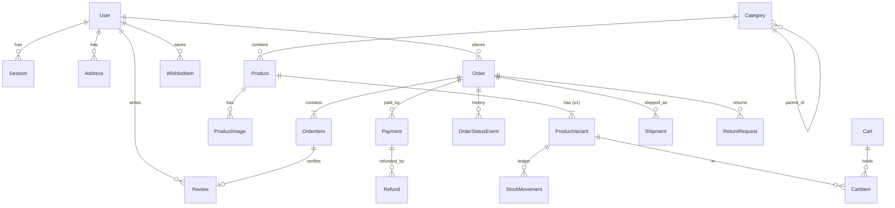
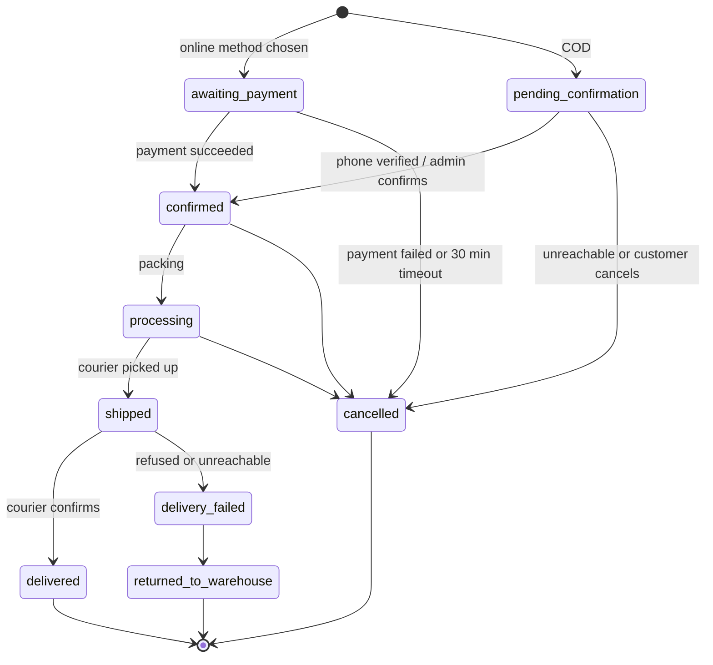
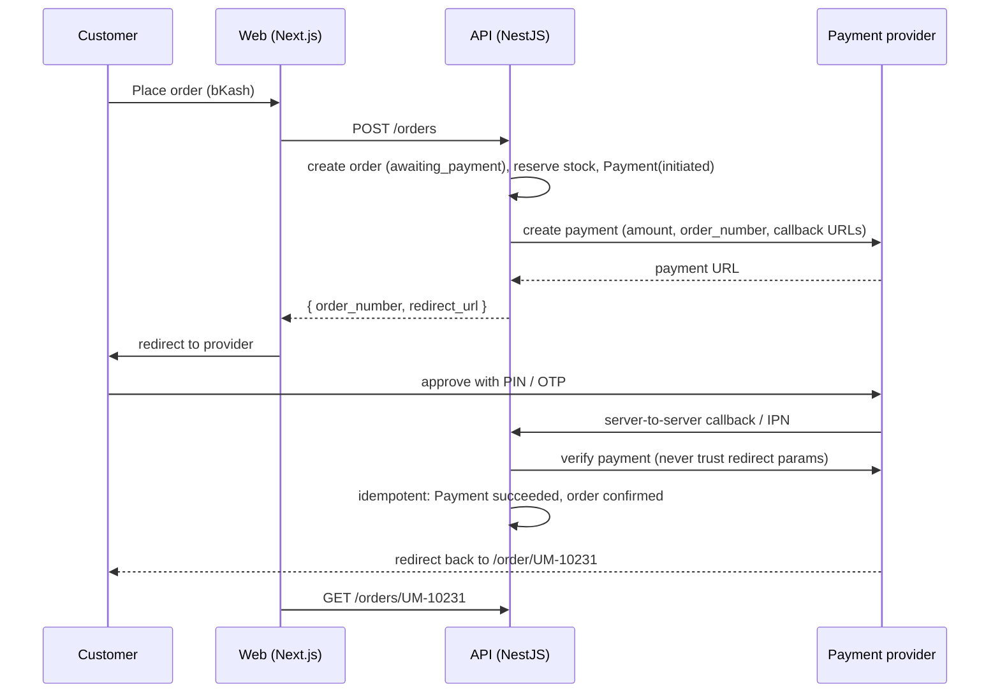

# UNA Mart — system design

This is the reference for what the product IS: pages, data, lifecycles and
API surface. `ARCHITECTURE.md` covers HOW it's built (stack decisions,
folders, tooling, deployment).

> **Status:** v2 draft (Oct 2026), written before backend work starts.
> Sections marked **DECIDE** need a founders' call before they're built.

## Phasing

- **Phase 1 (current)** — single seller (UNA Mart's own catalog), customer
  storefront, simple admin, NestJS backend replacing the fake `/api/*` data.
- **Phase 2** — multi-vendor: seller registration, seller dashboard,
  commission, payouts.
- **Phase 3** — supplier import (1688 / AliExpress dropshipping).

Only build what the current phase needs. P2 fields that exist now are kept
to a nullable `seller_id` — don't design further ahead than that.

## Route map

### Customer-facing (public) — Phase 1

| Route | Purpose | Status |
|---|---|---|
| `/` | Homepage | built |
| `/products` | All products (filters, sort) | built |
| `/category/[slug]` | Category listing (includes subcategories) | built |
| `/search?q=` | Search results | built |
| `/product/[slug]` | Product detail | built — needs variant picker |
| `/cart` | Cart | built |
| `/checkout` | Checkout (guest allowed) | built |
| `/order/[number]` | Order confirmation / status page | to build |
| `/track-order` | Guest order lookup (order number + phone) | built |
| `/wishlist` | Saved items | built (local only) |
| `/login`, `/register` | Phone + OTP auth | UI built, needs API |
| `/account` | Profile, addresses | to build |
| `/account/orders` | Order history, return requests | to build |
| `/about`, `/contact`, `/faq`, policy pages | Content | built |

### Admin panel (protected, role: admin) — Phase 1

| Route | Purpose |
|---|---|
| `/admin` | Overview: today's orders, pending confirmations, low stock |
| `/admin/orders`, `/admin/orders/[number]` | Order list, confirm/cancel, book courier, refunds |
| `/admin/products`, `/admin/products/[id]` | Products, variants, images, stock |
| `/admin/categories` | Category tree |
| `/admin/returns` | Return requests |
| `/admin/customers` | Customers and phone flags (COD risk) |
| `/admin/settings` | Delivery zones and fees |

### Seller dashboard / multi-vendor admin — Phase 2, not built

`/seller/*`, `/admin/sellers`, `/admin/payouts`.

## Conventions (apply to every entity and endpoint)

- **IDs:** UUID primary keys. Orders also get a human `order_number`
  (`UM-10231`) — that's what customers, couriers and support use.
- **Money:** integers in **poisha** (1 BDT = 100 poisha). Never floats.
  `৳1,990` is stored as `199000`. The API returns poisha; the frontend
  formats.
- **Time:** `timestamptz`, stored and returned in UTC ISO-8601. Display in
  Asia/Dhaka.
- **Phone:** normalized to E.164 (`+8801712345678`) before storing or
  comparing.
- **Soft state, not deletes:** products are archived, not deleted, because
  orders reference them.
- **Snapshots:** an order copies everything it needs (names, prices,
  address) at purchase time. Editing a product never changes a past order.

## Data model

Fields marked (P2) exist only as nullable columns in Phase 1.



### Identity

**User** — `id, name, phone (unique), email (unique, nullable),
password_hash (nullable), role (customer | admin | seller (P2)),
phone_verified_at, created_at, updated_at`

**Session** — `id, user_id, token_hash, expires_at, ip, user_agent,
created_at`. Server-side sessions; the browser holds only an httpOnly
cookie with the raw token.

**OtpCode** — `id, phone, code_hash, purpose (login | checkout),
attempts, expires_at, consumed_at, created_at`. 6 digits, 5-minute expiry,
max 5 attempts, max 3 sends per phone per 15 minutes.

**Address** — `id, user_id, recipient_name, phone, line1, area, city,
district, delivery_zone_id, is_default, created_at`

### Catalog

**Category** — `id, name, slug (unique), parent_id (nullable), sort_order,
image_url, is_active`

**Product** — `id, name, slug (unique), description, category_id, brand
(nullable), status (draft | active | archived), badge (new | sale | best,
nullable), free_delivery (bool), rating_avg, rating_count (denormalized
from published reviews), seller_id (P2), created_at, updated_at`

**ProductVariant** — `id, product_id, sku (unique), options (jsonb, e.g.
{"size":"M","color":"Navy"}), price, compare_at_price (nullable — the
"was" price, set only when discounted), stock_qty, is_active`

> Every product has at least one variant. A simple product (a power bank)
> has one "default" variant with `options = {}`. **Price and stock live on
> the variant, never on the product** — this is what makes sizes and colors
> possible without a migration later.

**ProductImage** — `id, product_id, variant_id (nullable — set for
color-specific photos), cloudinary_public_id, alt, sort_order`

**StockMovement** — `id, variant_id, delta (+/-), reason (order | cancel |
return | restock | adjustment), ref_type, ref_id, actor_id, created_at`.
An append-only ledger; `ProductVariant.stock_qty` is the running total.
Every stock change writes one row, so "where did 5 units go?" always has
an answer.

### Shopping

**Cart** — `id, user_id (nullable), guest_token (nullable, from cookie),
updated_at`. Guest carts expire after 30 days of inactivity. On login the
guest cart merges into the user's cart (quantities summed, capped at stock).

**CartItem** — `id, cart_id, variant_id, quantity`, unique
`(cart_id, variant_id)`.

**WishlistItem** — `user_id, product_id, created_at`, primary key on both.
Guest wishlists stay in localStorage and merge on login.

### Orders

**Order**
- `id, order_number (unique), user_id (nullable — guest checkout)`
- `customer_name, phone, email (nullable)` — contact snapshot
- `shipping_address (jsonb snapshot), delivery_zone_id`
- `status` — fulfilment, see lifecycle below
- `payment_method (cod | bkash | nagad | card)`
- `payment_status (unpaid | pending | paid | partially_refunded | refunded)`
- `subtotal, discount_total, delivery_fee, total` — all poisha
- `customer_note, admin_note, placed_at, updated_at`

**OrderItem** — `id, order_id, variant_id, product_name, variant_label,
sku, image_url, unit_price, quantity, line_total, seller_id (P2)`. All
snapshots.

**OrderStatusEvent** — `id, order_id, from_status, to_status, actor_type
(customer | admin | system | courier | payment), actor_id, note,
created_at`. Written on every status change. Powers the tracking timeline
and settles disputes.

### Money

**Payment** — `id, order_id, provider (cod | bkash | nagad | sslcommerz),
amount, status (initiated | pending | succeeded | failed | cancelled |
expired), provider_ref (unique per provider), idempotency_key (unique),
raw_response (jsonb), created_at, updated_at`. One order can have several
attempts; at most one may succeed.

**Refund** — `id, payment_id, order_id, amount, reason, status (requested |
processing | succeeded | failed), provider_ref, created_by, created_at`

### Delivery

**DeliveryZone** — `id, name (Inside Dhaka, Outside Dhaka, …), fee, eta_text,
is_active`. Fees are data, not code, so they change without a deploy.
Rule (same as the frontend's `lib/pricing.ts`): the fee is waived when
every item has `free_delivery`.

**Shipment** — `id, order_id, courier (steadfast | pathao | …),
consignment_id, tracking_code, status (booked | picked_up | in_transit |
delivered | returned | cancelled), cod_amount, cod_collected_at,
settled_at, raw_payload (jsonb), created_at, updated_at`

### After-sales and trust

**ReturnRequest** — `id, order_id, order_item_id, quantity, reason,
photo_urls, status (requested | approved | rejected | received |
refunded), resolution (refund | replacement), created_at, resolved_at`

**Review** — `id, product_id, user_id, order_item_id (proves a verified
purchase), rating (1–5), comment, status (pending | published |
rejected), created_at`. Only buyers of a delivered item can review.

**PhoneFlag** — `phone (pk), cod_refused_count, cod_delivered_count,
is_blocked, note, updated_at`. Feeds the COD risk rules below.

**AuditLog** — `id, actor_id, action, entity_type, entity_id, before
(jsonb), after (jsonb), created_at`. Every admin write to prices, stock,
orders and refunds.

### Phase 1.5 (designed, not built at launch)

**Coupon** / **CouponRedemption** — removed from the storefront until the
backend supports them. When built: code, type (percent | fixed), value,
min_subtotal, max_uses, per_phone_limit, starts_at, ends_at.

## Order lifecycle

Fulfilment `status` and `payment_status` are **separate fields**. "Paid" is
not a step in delivery: a COD order is shipped unpaid, and an online order
can be paid but not yet packed.



Rules:
- **Only the orders module changes `status`**, through one
  `transition(order, to, actor)` function. It rejects any move not in the
  diagram and writes an `OrderStatusEvent`.
- **Stock is decremented when the order is created** (both COD and
  online), inside the same transaction:
  `UPDATE product_variant SET stock_qty = stock_qty - $qty WHERE id = $id
  AND stock_qty >= $qty`. If any row affects 0 rows, the whole order fails
  with "only N left". This is what prevents overselling.
- **Stock is returned** on `cancelled` and `returned_to_warehouse` (one
  `StockMovement` each), and on approved returns once the item is received.
- **`awaiting_payment` expires after 30 minutes** (scheduled job): cancel
  the order and restock.
- **Customers may cancel** only while `pending_confirmation`,
  `awaiting_payment` or `confirmed`. After packing, they contact support.

## Key flows

### COD checkout (most orders)

1. The client sends `POST /orders` with `payment_method: "cod"`.
2. The server re-prices everything from the database, checks stock, and
   applies the COD risk rules (below).
3. In one transaction it creates the order (`pending_confirmation`), its
   items and a COD `Payment` (`pending`), and decrements stock.
4. It sends an SMS confirmation and returns `order_number`.
5. Admin confirms: automatically if the phone was OTP-verified, otherwise
   with a call. The order moves to `confirmed`, then the courier is booked
   and a `Shipment` created.
6. Courier webhooks drive `shipped` → `delivered`. On delivery with cash
   collected, the COD `Payment` → `succeeded` and `payment_status` → `paid`.
7. Courier settlement (cash transferred to UNA Mart) sets
   `Shipment.settled_at`.

### Online payment (bKash / Nagad / card via aggregator)



Rules:
- **The API verifies every payment with the provider** before marking it
  paid. Query-string parameters on the redirect are never trusted.
- **Callbacks are idempotent:** `provider_ref` is unique, so a repeated
  callback is a no-op.
- **A daily reconciliation job** compares the provider's settlement report
  with `Payment` rows and flags any mismatch for admin.

### Refunds and returns

Return request → admin approves → item received (restock) → `Refund`
created. Online payments are refunded through the provider API. COD
refunds are paid manually via bKash/Nagad, with the reference recorded
on the `Refund`. `payment_status` then becomes `refunded` or
`partially_refunded`.

### COD risk rules (**DECIDE** the thresholds)

- A phone with `is_blocked` cannot choose COD (online payment only).
- A phone with ≥ 2 refused COD deliveries needs OTP verification or an
  advance payment of the delivery fee.
- COD orders above **৳X** (suggest ৳10,000) need OTP verification.
- First-time phones get an OTP before order placement (or a confirmation
  call — pick one).

## API surface (NestJS, Phase 1)

Base path `/v1`. Errors always have the shape
`{ "statusCode": 409, "code": "OUT_OF_STOCK", "message": "Only 3 left" }`.
List endpoints return `{ "items": [...], "total": 120, "page": 1,
"pageSize": 24 }`.

```
# Catalog
GET    /products                ?category= &q= &ids= &price_min= &price_max=
                                &in_stock= &on_sale= &sort= &page= &pageSize=
GET    /products/:slug          includes variants + images
GET    /products/:slug/reviews
GET    /categories              full tree

# Auth (phone-first)
POST   /auth/otp/request        { phone, purpose }
POST   /auth/otp/verify         { phone, code } -> sets session cookie
POST   /auth/logout
GET    /auth/me

# Account
GET/POST/PATCH/DELETE  /me/addresses
GET/POST/DELETE        /me/wishlist

# Cart (guest cookie or session)
GET    /cart
POST   /cart/items              { variantId, quantity }
PATCH  /cart/items/:id          { quantity }
DELETE /cart/items/:id

# Orders
POST   /orders                  checkout; returns order + optional redirect_url
GET    /orders                  my orders (auth)
GET    /orders/:number          auth owner, or guest with ?phone=
POST   /orders/:number/cancel
POST   /orders/:number/returns

# Reviews
POST   /reviews                 verified buyers only

# Provider webhooks (signature-verified, not for browsers)
POST   /webhooks/payments/:provider
POST   /webhooks/couriers/:courier

# Admin (role: admin)
GET/POST/PATCH  /admin/products, /admin/products/:id/variants
POST   /admin/uploads/sign      Cloudinary signed upload
GET    /admin/orders            filters: status, date, payment
POST   /admin/orders/:number/transition   { to, note }
POST   /admin/orders/:number/shipments    book courier
POST   /admin/refunds
GET/PATCH  /admin/returns/:id
GET/POST/PATCH  /admin/categories
GET/PATCH  /admin/delivery-zones
GET/PATCH  /admin/phone-flags/:phone
GET    /admin/audit-log
```

### Changes the frontend needs when switching to this API

The Phase 1 fake API was shaped like v1 of this doc. Moving to v2 means:
- money in poisha (divide by 100 in `formatPrice`);
- paginated list responses;
- cart items use `variantId` instead of `productId`, plus a variant picker
  on the product page;
- separate `status` and `payment_status` (the Track Order timeline uses the
  new statuses);
- `POST /orders` may return `redirect_url` (online payment);
- `/order/[number]` confirmation page;
- OTP login.

## Auth and roles

Roles: `customer`, `admin`, `seller` (P2). The role check happens in NestJS
guards. A hidden frontend route is not a protected route. Admin accounts
require an OTP on every login, plus a password.

## Legal and compliance (verify before launch)

Bangladesh's **Digital Commerce Operation Guidelines (2021, with later
amendments)** set rules on delivery timelines, refund deadlines, product
information and advance-payment handling. Check the current version with
a local advisor, and make the policy pages and refund SLAs match it.
